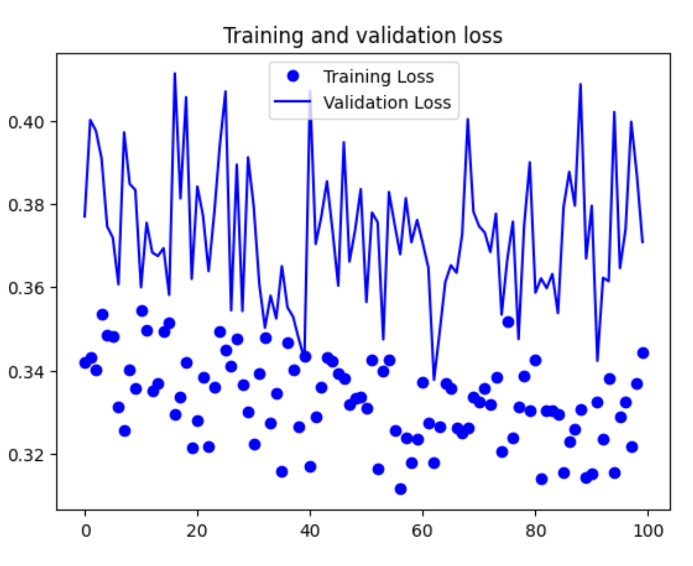

# Histopathologic Cancer Detection
*Deep Learning Task involving CNNs*

### Project Description
The goal of this project is to create an algorithm that identifies metastatic tissue in histopathologic scans of lymph node sections. Small image patches were taken from larger digital pathology scans.  The model should predict if the center 32x32px region of a patch contains at least one pixel of tumor tissue.Results will be evaluated on area under the ROC curve between the predicted probability and the observed target.

### Data Description
The training data consists of 220025 unique images, with a corresponding train_labels.csv file with ground truth for each training image by id.  Each image is a 28KB uncompressed TIF with dimensions [96,96,3].  The test data consists of 57458 unique images. **Both training and test sets can be accessed using the Kaggle link below.** Here is an example patch from the training set:

  

W. Cukierski, “Histopathologic cancer detection,” https://kaggle.com/competitions/histopathologic-cancer-detection, 2018, kaggle.

### Conclusions

- Initially by steps per epoch and validation steps were off.  This created volitility in the accuracy and loss.  To keep the notebook a reasonable size, I discarded those models, but below are screenshots of the acuracy and loss plots.

- To increase performance of all models, I would include the validation set (made out of training data) in the training.
- When I switched to run the models using GPUs, the results changed drastically.  I'm curious as to why that would be.
- VGG16 seemed too big of a model to train, and led to overfitting. Using a learning rate decay didn't seem to help the issue. Here were the accuracy and loss by epoch using learning rate decay, but starting with lr=0.001:

it didn't improve even with a drastic lowering of learning rate. This model performed considerably worse on training set, even after changing hyper-paramers multiple times, so I didn't submit it to kaggle.

- All models used Binary Crossentropy for loss function.
 
### Learning/Takeaways
- CNNs take an incredible amount of time, energy, compute to train.
- Overfitting is easy to do!
- Using GPU saved considerable time.
- Hyper-parameter intuition doesn't necessary transfer to other models.
